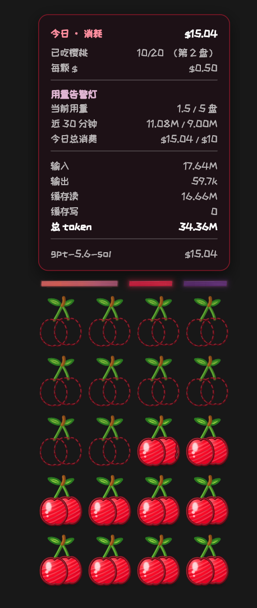
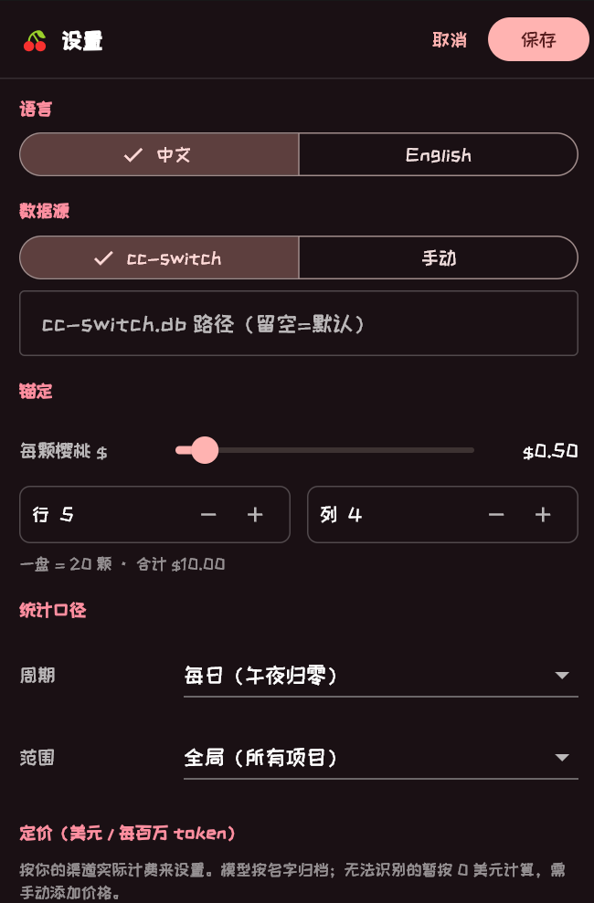

# SomeCherries

> **Beta 测试版**：当前版本用于公开测试，欢迎通过 GitHub Issues 反馈问题。

一个常驻桌面的 Claude Code / cc-switch Token 用量监视器。消费金额会变成一盘樱桃：随着 Token 消耗，樱桃被慢慢吃掉，并通过三色告警灯提示当前用量、近 30 分钟速度和今日消费。

## 实际界面

<table>
  <tr>
    <td align="center"><strong>用量悬浮窗</strong></td>
    <td align="center"><strong>设置界面</strong></td>
  </tr>
  <tr>
    <td></td>
    <td></td>
  </tr>
</table>

目前提供可直接使用的 **Windows x64 Beta** 版本，界面支持中文和 English。

## 下载与安装

1. 打开 [SomeCherries v0.2.0-beta.1](https://github.com/MolezzzZ/SomeCherries/releases/tag/v0.2.0-beta.1)。
2. 下载 `SomeCherries-0.2.0-beta.1-windows-x64.zip`。
3. 将压缩包**完整解压**到任意文件夹。
4. 双击 `SomeCherries.exe`。

> 请勿只复制 exe。程序运行还需要同目录下的 DLL 和 `data` 文件夹。Windows 首次运行若显示 SmartScreen 提示，可在确认下载来源后选择“更多信息”→“仍要运行”。

## 使用方法

程序默认读取：

```text
%USERPROFILE%\.cc-switch\cc-switch.db
```

确保 [cc-switch](https://github.com/farion1231/cc-switch) 已产生用量记录即可。首次启动时悬浮窗出现在主屏幕右下角：

- 拖动樱桃盘可改变位置；悬停可查看 Token 与费用详情。
- 右键樱桃盘或系统托盘图标可打开设置、切换点击穿透或退出。
- 设置中可修改统计周期、项目范围、樱桃单价、布局、透明度、刷新频率和告警阈值。
- 如果数据库不在默认位置，请在“设置 → 数据源”填写 `cc-switch.db` 的绝对路径。

### 手动数据源

不使用 cc-switch 时，可在设置中选择“手动”，并把 `manual_usage.json` 放到：

```text
%APPDATA%\MolezzzZ\SomeCherries\manual_usage.json
```

示例：

```json
{
  "entries": [
    {
      "model": "claude-sonnet-4-6",
      "input": 1000,
      "output": 500,
      "cacheRead": 0,
      "cacheCreation": 0,
      "ts": 1782725952
    }
  ]
}
```

`ts` 是 Unix 时间戳（秒）。手动模式会使用设置中的模型价格计算费用。

## 功能

- 将消费金额映射为会逐渐被吃掉的樱桃盘
- 当前用量、近 30 分钟 Token、今日消费三组告警灯
- 日 / 周 / 月 / 全部统计周期
- 全局或当前 Claude Code 项目范围
- 中文 / English 界面
- 可拖动、置顶、透明度和点击穿透
- 系统托盘菜单与配置持久化
- cc-switch SQLite 只读访问，不修改原数据库

## 从源码构建

需要 Flutter stable（当前使用 Flutter 3.44.4）、Visual Studio 2022 的“使用 C++ 的桌面开发”工作负载，以及 Windows 10/11 SDK。

```powershell
flutter pub get
flutter analyze
flutter test
flutter build windows --release
```

可运行文件位于：

```text
build\windows\x64\runner\Release\SomeCherries.exe
```

生成与 GitHub Release 相同格式的压缩包：

```powershell
.\tool\package_windows.ps1
```

产物及 SHA-256 校验文件会写入 `dist\`。

## 发布维护

版本号以 `pubspec.yaml` 为准。完成验证后推送 `v*` 标签，GitHub Actions 会自动构建 Windows x64 压缩包、生成 SHA-256，并创建 Release；含预发布后缀的标签会标记为 Pre-release：

```powershell
git tag v0.2.0-beta.1
git push origin v0.2.0-beta.1
```

版本历史见 [CHANGELOG.md](CHANGELOG.md)。

## 隐私

程序只在本机读取 cc-switch 数据库或手动 JSON，不上传 Token 记录。数据库以只读方式打开。

## 许可

当前仓库未附带开源许可证；未经明确授权，不授予复制、修改或再分发源代码的权利。Release 中的程序供最终用户下载使用。
