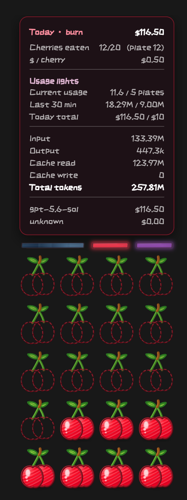
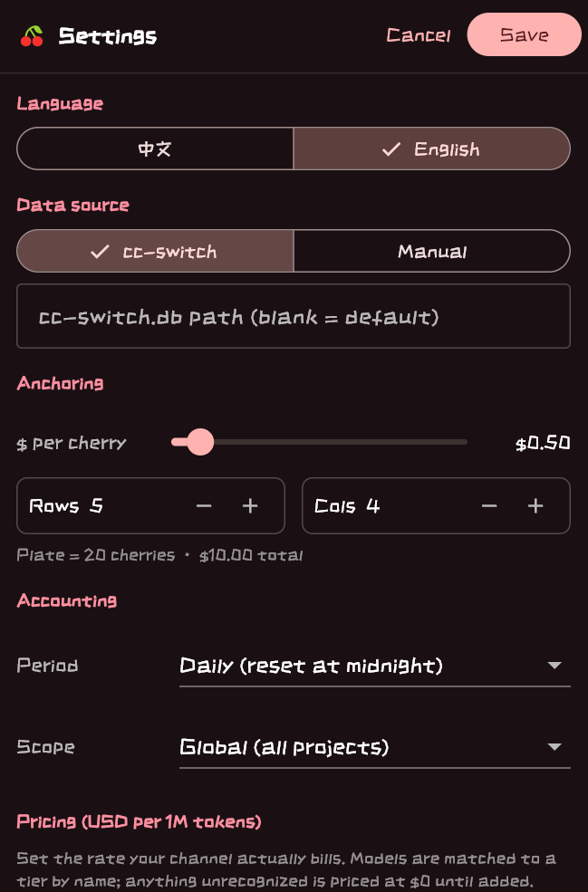

# SomeCherries

[English](README.md) | [简体中文](README.zh-CN.md)

> **Beta:** This project is currently in public testing. Feedback and bug reports are welcome through GitHub Issues.

SomeCherries is an always-on desktop monitor for token usage recorded by [cc-switch](https://github.com/farion1231/cc-switch). It turns billed usage into a plate of cherries: as tokens are consumed, the cherries are gradually eaten, while three warning lights track current usage, the last 30 minutes, and today's spend.

SomeCherries counts every usage and billing entry available in cc-switch. It works whether the traffic comes from a relay/provider API or an official subscription—as long as cc-switch records the usage, SomeCherries can include it in the statistics.

## Screenshots

<table>
  <tr>
    <td align="center"><strong>Usage overlay</strong></td>
    <td align="center"><strong>Settings</strong></td>
  </tr>
  <tr>
    <td></td>
    <td></td>
  </tr>
</table>

A ready-to-use **Windows x64 Beta** build is available. The interface supports both English and Chinese.

## Download and install

1. Open the [SomeCherries v0.2.0-beta.1 release](https://github.com/MolezzzZ/SomeCherries/releases/tag/v0.2.0-beta.1).
2. Download `SomeCherries-0.2.0-beta.1-windows-x64.zip`.
3. **Extract the complete archive** into any folder.
4. Run `SomeCherries.exe`.

> Do not copy the EXE by itself. The application also requires the DLL files and the `data` directory shipped beside it. If Windows SmartScreen appears on first launch, verify the download source, select **More info**, and then choose **Run anyway**.

## Usage

By default, SomeCherries reads:

```text
%USERPROFILE%\.cc-switch\cc-switch.db
```

Once cc-switch has created usage records, launch SomeCherries and the overlay will appear in the bottom-right corner of the primary display.

- Drag the cherry plate to move it; hover over it to inspect token and cost details.
- Right-click the plate or use the system tray icon to open Settings, enable click-through mode, or quit.
- Settings include the reporting period, project scope, price per cherry, layout, opacity, refresh interval, and alert thresholds.
- If your database is elsewhere, enter the absolute path to `cc-switch.db` under **Settings → Data source**.

### Manual data source

If you are not using cc-switch, select **Manual** in Settings and place `manual_usage.json` at:

```text
%APPDATA%\MolezzzZ\SomeCherries\manual_usage.json
```

Example:

```json
{
  "entries": [
    {
      "model": "gpt-5.6-sol",
      "input": 1000,
      "output": 500,
      "cacheRead": 0,
      "cacheCreation": 0,
      "ts": 1782725952
    }
  ]
}
```

`ts` is a Unix timestamp in seconds. Manual mode calculates cost using the model prices configured in Settings.

## Features

- Visualizes billed usage as a plate of gradually eaten cherries
- Includes all usage recorded by cc-switch, across relay APIs and official subscriptions
- Three warning lights for current usage, tokens used in the last 30 minutes, and today's spend
- Daily, weekly, monthly, and all-time reporting periods
- Global or current-project scope
- English and Chinese interface
- Draggable, always-on-top overlay with opacity and click-through controls
- System tray menu and persistent configuration
- Read-only access to the cc-switch SQLite database
- Optional manual JSON source with configurable model pricing

## Build from source

Requirements:

- Flutter stable (currently Flutter 3.44.4)
- Visual Studio 2022 with the **Desktop development with C++** workload
- Windows 10/11 SDK

```powershell
flutter pub get
flutter analyze
flutter test
flutter build windows --release
```

The runnable application is written to:

```text
build\windows\x64\runner\Release\SomeCherries.exe
```

To create the same archive format used by GitHub Releases:

```powershell
.\tool\package_windows.ps1
```

The archive and its SHA-256 checksum are written to `dist\`.

## Release maintenance

The version is defined in `pubspec.yaml`. After validation, pushing a `v*` tag triggers GitHub Actions to build the Windows x64 archive, generate its SHA-256 checksum, and create a Release. Tags containing a prerelease suffix are marked as prereleases.

```powershell
git tag v0.2.0-beta.1
git push origin v0.2.0-beta.1
```

See [CHANGELOG.md](CHANGELOG.md) for the version history.

## Privacy

SomeCherries reads the cc-switch database or manual JSON file locally. Token usage records are never uploaded, and the SQLite database is opened read-only.

## License

This repository does not currently include an open-source license. No permission to copy, modify, or redistribute the source code is granted unless explicitly stated. Release builds are provided for end-user use.
